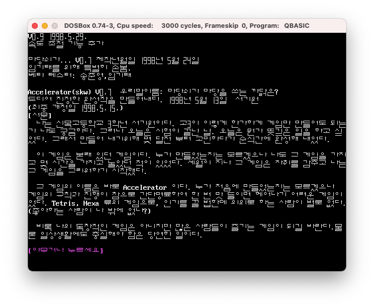
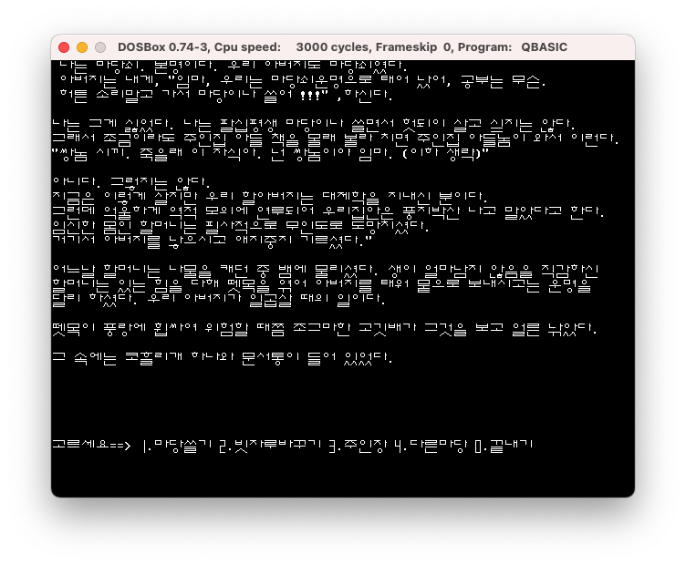
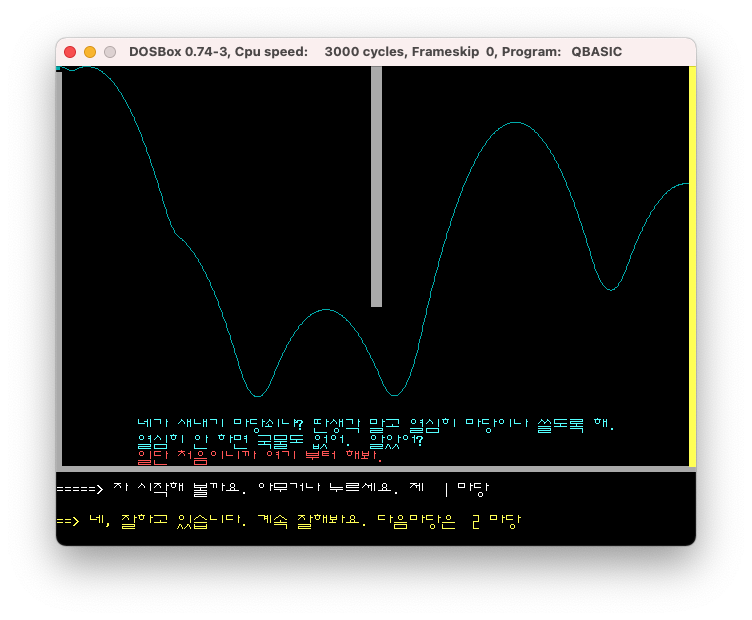

# Accel
Copyright (c) 1998 Keewon Seo

소스 코드 및 스테이지 파일 내 한글은 조합형 코드로 되어있습니다.

Dosbox 와 Qbasic 으로 실행할 수 있습니다.







---
```
v0.9 1998.5.29.
속도 조절 기능 추가

마당쇠가... v0.7 제작년월일 1998년 5월 24일
임기태를 위해 특별히 손봄.
베타 테스터: 송준영,임기태

Accelerator(skw) v0.7 우리말이름: 마당쇠가 마당을 쓰는 까닭은?
드디어 진정한 완성작을 만들어내다. 1998년 5월 13일 서기원
(최종 개정일 1998.5.15.)

[서문]
 나는 신목고등학교 3학년 서기원이다. 고3이 이렇게 한가하게 게임만 만들어도 되는
가 나도 궁금하다. 그러나 오늘은 시험이 끝난 날. 오늘은 뭔가 뜻깊은 일을 하고싶
었다. 그래서 만들어 내기위해 몇 달전 부터 고민하다가 순식간에 완성해 내었다.

 이 게임은 본래 있던 게임이다. 누가 만들었는지는 모르겠으나 나도 그 게임을 가지
고 몇 시간을 가지고 놀았던 적이 있었다. 세월이 지나 그 게임은 자취를 감추고 나는
그 게임을 그리워하기 시작했다.

 그 게임의 이름은 바로 Accelerator 이다. 누가 처음에 만들었는지는 모르겠으나
게임의 규칙과 진행이 참으로 간단명료하여 한 번 맛 들이면 헤어나기 어려운 게임이
었다. Tetris, Hexa 류의 게임으로, 인기를 끌 법한데 의외로 하는 사람이 별로 없다.
(좋아하는 사람이 나 밖에 없나?)

 비록 나의 독창적인 게임은 아니지만 많은 사람들이 즐기는 게임이 되길 바란다. 물
론 일상생활에도 충실해야 함은 당연한 일이다.

[아무거나 누르세요]
```
